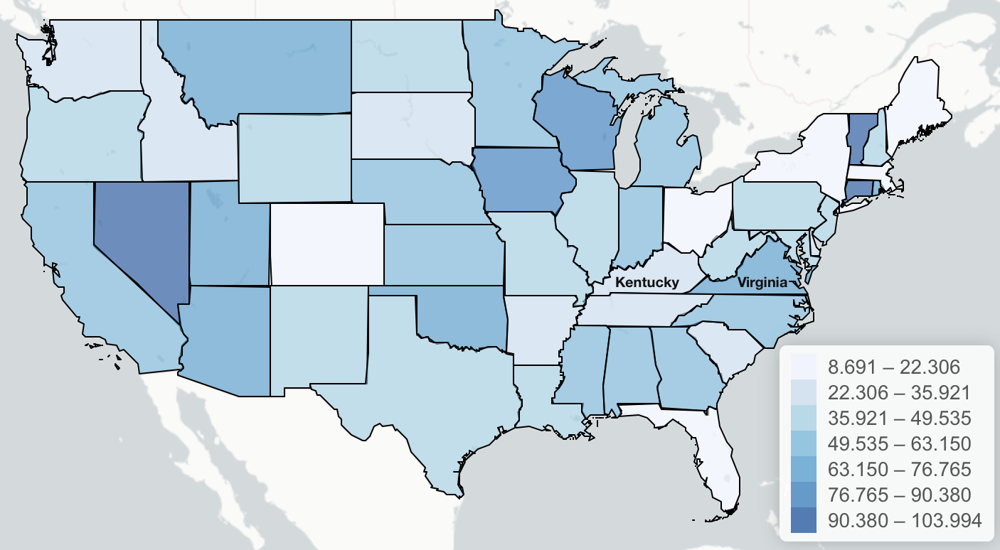
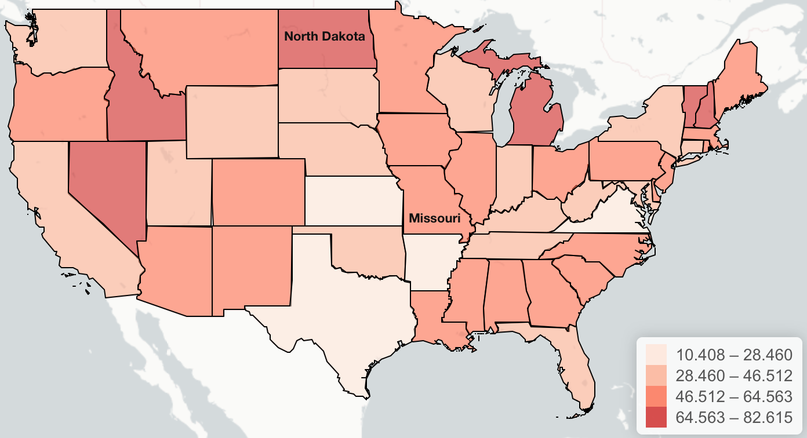
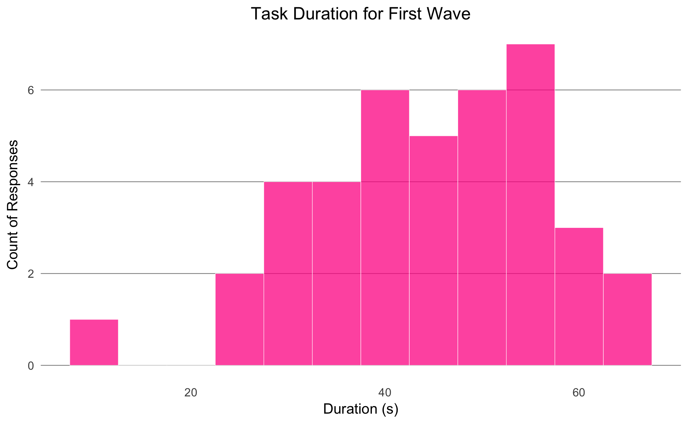
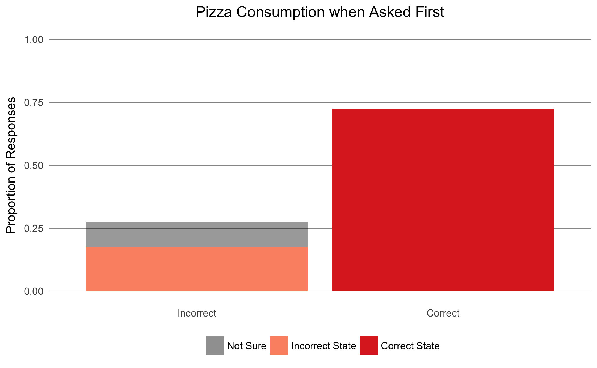
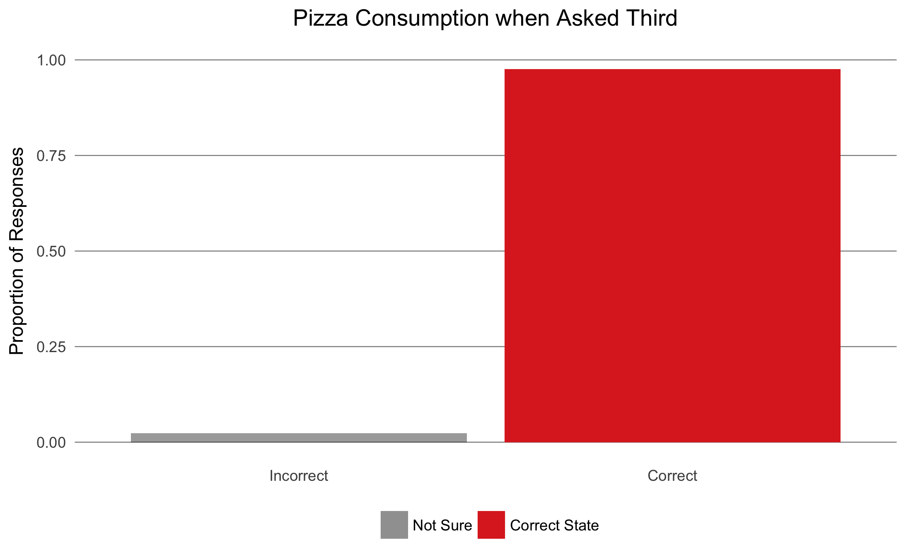

Data Visualization Experiment
================
Reid McIlroy-Young & Erin M. Ochoa
2018/05/04

Questions
=========

Our initial question for this experiment was: "How does the emotional nature of the topic affect the reading comprehension of a visualization?" More specifically, when shown a map that displays data about which the reader has preconceived notions or an emotional response, does their degree of comprehension differ compared to that of a more neutral dataset? We hypothesized that visualizations of data about emotionally charged topics would have lower comprehension rates.

However, early results suggested that map-specific comprehension was function of prior experience with the same type of visual; this led us to form the following question: "Does repeated exposure to a given type of visualization increase comprehension in later exposures?" We hypothesized that comprehension of a given type of visualization would increase with repeated exposures, even when the data differed across exposures.

Survey
======

To see how framing or order affect comprehension, we created three maps, each using simulated data:

Before showing the participants a map, they were presented with the following prompt, or one very similar:

> You will be shown a map of the US displaying the annual rainfall by state, for five seconds. On it, two states are marked (Kentucky and Virginia). After viewing please indicate which has higher rainfall.

> When you are ready to see the map, please click ready.

The three topics are: rainfall, pizza consumption, and homicide rate, each by state in the contiguous United States. The first two we consider to be emotionally neutral, with the last being emotional and something most respondents would be informed about. The middle we do not assume participants are informed about, while the first they likely have non-emotional assumptions about.

Each map has two states labeled (chosen to have similar area) and the participant was given five seconds to view the image (loading time of the image likely made the functional viewing time four seconds, but it was not measured). The images do not say which condition they are for, but the green map was always used for homicide, the red for pizza consumption, and the blue for rainfall.

Then participants were asked the following question, or a similar one:

> Which state had higher rainfall?  1. Kentucky  2. Virginia  3. I am not sure

This was repeated for each of the other two maps, yielding three measurements per participant.

After the last question, participants were shown the following:

> None of the data used in this experiment is real. Please do not use the maps.  Thank you for helping us.

Experiment
==========

We conducted a total of four survey waves using Amazon Mechanical Turk. All limited respondents to the United States. The first survey asked for twenty responses and paid $0.10 a HIT. It was used as a pilot survey and a few concerns were identified; the pilot survey data is not used for the results herein. Next, a survey asking about pizza, homicide, then rain was conducted at $0.05 a HIT with fifty responses. Two additional surveys, each at $0.06 a HIT, varied the order of the maps: rain, pizza, then homicide, and homicide, rain, then pizza; the ordering across the surveys ensured that each map was shown first, second, and third. This gives a control on order, which seemed to affect the results.

Results
=======

Most responses were good, with about 80% of respondents taking enough time to work thought the questions.

The plot above shows the duration of response times for the first fifty-person survey. We removed all responses with completion times shorter than twelve seconds, yielding the final response counts:

| Condition             | Count |
|-----------------------|-------|
| Pizza, homicide, rain | 40    |
| Homicide, rain, pizza | 42    |
| Rain, pizza, homicide | 40    |

Nature of Topic
---------------

We performed Fisher's Exact test across topics (with order held constant). Analyses indicated no variation in the comprehension associated with different topics. This invalidates the first hypothesis: there is no evidence to suggest that comprehension depends upon the nature of the data.

Order of Visualization
----------------------

With further analyses, we found that the order of questioning was a significant factor in response accuracy.

  

The same result holds for all other maps (see `analysis/analysis.Rmd` for all plots); the table below shows the fraction of wrong answers across topics and order:

| Topic    | First | Second | Third |
|----------|-------|--------|-------|
| Pizza    | 0.275 | 0.025  | 0.023 |
| Rain     | 0.3   | 0.095  | 0.05  |
| Homicide | 0.309 | 0.125  | 0.05  |

To evaluate the hypothesis regarding order, Fisher's Exact Test was performed across all three order intervals for each map, with the following results:

| Topic    | *p*-value        |
|----------|------------------|
| Pizza    | 0.0002174 \*\*\* |
| Rain     | 0.005158 \*\*    |
| Homicide | 0.005765 \*\*    |

The results show that the proportion of incorrect answers varies over order for all three topics. This implies that participants' visualization comprehension improved with subsequent maps.

Discussion
==========

We set out to investigate whether the subject matter of a visualization affects the degree to which readers comprehend the information being conveyed. An initial hypothesis predicted that visualizations of emotionally charged topics would result in lower comprehension. Early results suggested that comprehension improved with additional exposure to similar visualizations, so our research design changed to investigate the effect of order on comprehension.

Across-topic analyses indicate that, even controlling for the order in which visualizations are shown, the level of comprehension is not dependent upon readers' emotional nature or preconceived notions related to the topic.

Within-topic analyses, on the other hand, show that the later a visualization is shown, the greater the readers' comprehension level. This has implications for the order in which authors present their visualizations. The results herein suggest that an author with several visualizations of the same type should present the least important ones first and the most important one last because readers are likely to understand the content of later visualizations best.

Furthermore, the results imply that repeated exposure to a given type of visualization increases comprehension. This means that authors and audiences alike may benefit from the inclusion of more visualizations. Contrary to concerns about overwhelming audiences with less-critical visualizations, such charts and maps should be included early to teach readers how to interpret the given type of visualization as repeated exposure is likely to lead to increased comprehension.

